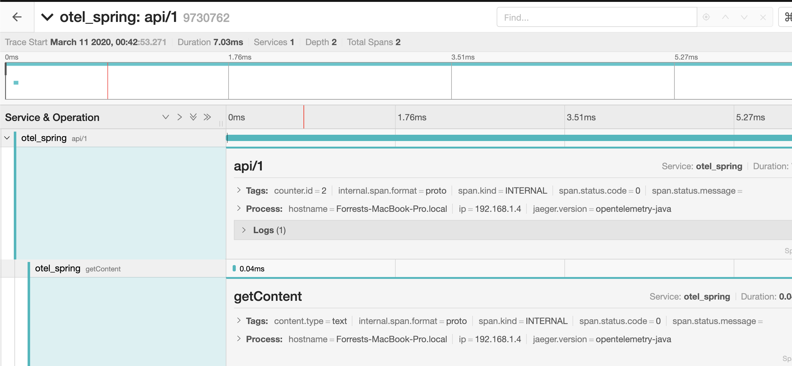
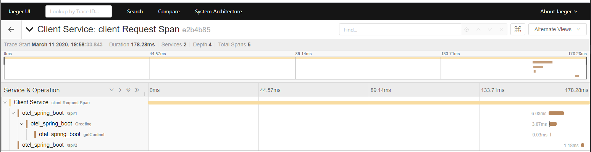

This Quick Start shows you how to use OpenTelemetry in your Java app to:

* Configure a tracer in Spring Boot using it's idioms.
* Trace at the framework level
* Generate trace data
* Propagate context in the application’s context
* Propagate context over HTTP from a client
* Export the trace data to the console and to Jaeger
* Use Jaeger to view the trace data
  
This Quick starts uses a simple Spring Boot Rest service and then adds in a client to send it request to show how to propogate context over HTTP.

# Requirements
Java version 7 or newer

# Setup
1) Use the Spring initalizer to create a Spring Boot Application with Spring Web as a dependency. 


2) Add the Open tracing SDK dependency as well as the jaegar exporter dependencies
``` xml
        <dependency>
      		<groupId>io.opentelemetry</groupId>
     		<artifactId>opentelemetry-api</artifactId>
      		<version>0.2.0</version>
        </dependency>
		<dependency>
      		<groupId>io.opentelemetry</groupId>
     		<artifactId>opentelemetry-sdk</artifactId>
      		<version>0.2.0</version>
        </dependency>
		<dependency>
			<groupId>io.opentelemetry</groupId>
			<artifactId>opentelemetry-exporters-logging</artifactId>
			<version>0.2.0</version>
		</dependency>
		<dependency>
			<groupId>io.opentelemetry</groupId>
			<artifactId>opentelemetry-exporters-jaeger</artifactId>
			<version>0.2.0</version>
		</dependency>

		<dependency>
			<groupId>io.grpc</groupId>
			<artifactId>grpc-protobuf</artifactId>
			<version>1.27.2</version>
		</dependency>
		<dependency>
			<groupId>io.grpc</groupId>
			<artifactId>grpc-netty</artifactId>
			<version>1.27.2</version>
		</dependency>
```

3) Create a model to return from our future controller
``` java
   package com.otel.demo;


public class Greeting {

    private final long id;
    private final String content;

    public Greeting(long id, String content) {
        this.id = id;
        this.content = content;
    }

    public long getId() {
        return id;
    }

    public String getContent() {
        return content;
    }
}
```

4) Create a controller to return our model. 

``` java
package com.otel.demo;

import java.util.concurrent.atomic.AtomicLong;


import org.springframework.web.bind.annotation.RequestMapping;
import org.springframework.web.bind.annotation.RequestParam;
import org.springframework.web.bind.annotation.RestController;


@RestController
public class SomeController {
    private final AtomicLong counter = new AtomicLong();

    
    @RequestMapping("/api/1")
    public Greeting greeting(@RequestParam(value="name", defaultValue="level1Default") String name) {

            return new Greeting(counter.incrementAndGet(), getContent());

    }

    public String getContent(){

        return "Some content";
    }

}
```
5) Do `mvn spring-boot:run` to run the application. Navigate to localhost:8080/api/1 to see your content and make sure you have everything configured correctly.

# Collect Trace Data
You need to configure a TraceProvider to collect tracing information. A tracer is an object that tracks the currently active span and allows you to create (or activate) new spans. As spans are created and completed, the tracer dispatches them to an exporter that can send the spans to a backend system for analysis.

We want a singleton for our application, so we'll create a Bean that returns our tracer instance.

1) Create a class called OtelConfig that looks like this.
``` java
package com.otel.demo;

import org.springframework.boot.autoconfigure.jdbc.DataSourceAutoConfiguration;
import org.springframework.boot.autoconfigure.orm.jpa.HibernateJpaAutoConfiguration;
import org.springframework.context.annotation.Bean;
import org.springframework.context.annotation.Configuration;

import io.grpc.ManagedChannelBuilder;
import io.opentelemetry.OpenTelemetry;
import io.opentelemetry.sdk.OpenTelemetrySdk;
import io.opentelemetry.sdk.trace.SpanProcessor;
import io.opentelemetry.sdk.trace.export.SimpleSpansProcessor;
import io.opentelemetry.trace.Tracer;
import io.opentelemetry.exporters.jaeger.JaegerGrpcSpanExporter;
import io.opentelemetry.exporters.logging.*;

import org.springframework.boot.autoconfigure.EnableAutoConfiguration;


@Configuration
@EnableAutoConfiguration (exclude={DataSourceAutoConfiguration.class, HibernateJpaAutoConfiguration.class})
public class OtelConfig {

    @Bean
    public Tracer otelTracer() throws Exception{
        final Tracer tracer = OpenTelemetry.getTracerFactory().get("com.forrest.levelone");
        SpanProcessor jaegerProcessor =
            SimpleSpansProcessor.newBuilder(JaegerGrpcSpanExporter.newBuilder()
            .setServiceName("otel_spring")
            .setChannel(ManagedChannelBuilder.forAddress(
            "localhost", 14250).usePlaintext().build())
            .build()).build();    

        SpanProcessor logProcessor = SimpleSpansProcessor.newBuilder(new LoggingExporter()).build();

        OpenTelemetrySdk.getTracerFactory().addSpanProcessor(logProcessor);
        OpenTelemetrySdk.getTracerFactory().addSpanProcessor(jaegerProcessor);

        return tracer;
    }
}
```

### What's here?
* First, the `Tracer`. This class is responsible for building spans which make up our future traces.
* `Span Processors` and/or `Exporters` are responsible for doing something with our spans, and multiple can be registered to a single tracer. Here we see that we are using a Logging exporter as well as the `JaegerGrpcSpanExporter`. The former logs spans to the console which is great during dev, and the latter sends spans to Jaeger, which we are going to run shortly.
* Sending spans to Jaeger requires setting up a gRPC `ManagedChannel` which is why we pulled those dependencies in earlier. Here we are sending them to `localhost port` `14250`. Jaeger accepts gRPC spans to this port by default


2) Get an Autowired Tracer instance in our Controller.
``` java
  
    @Autowired
    Tracer tracer;
```
3) and now let's create some spans.
``` java
package com.otel.demo;

import java.util.concurrent.atomic.AtomicLong;

import org.springframework.beans.factory.annotation.Autowired;
import org.springframework.web.bind.annotation.RequestMapping;
import org.springframework.web.bind.annotation.RequestParam;
import org.springframework.web.bind.annotation.RestController;

import io.opentelemetry.context.Scope;
import io.opentelemetry.trace.Span;
import io.opentelemetry.trace.Tracer;


@RestController
public class SomeController {
    private final AtomicLong counter = new AtomicLong();

    @Autowired
    Tracer tracer;
    
    @RequestMapping("/api/1")
    public Greeting greeting(@RequestParam(value="name", defaultValue="level1Default") String name) {
            Span span = tracer.spanBuilder("api/1").startSpan();
            span.addEvent("Controller Entered");
            span.setAttribute("counter.id", counter.get());
            
            try(Scope scope = tracer.withSpan(span)){
                return new Greeting(counter.incrementAndGet(), getContent());
            }
            catch(Exception e){
                span.addEvent("error");
                span.setAttribute("error", true);
                return new Greeting(0l, "critical failure");
            }
            finally{
                span.end();
            }

    }

    public String getContent(){
        Span span = tracer.spanBuilder("getContent").startSpan();
        span.setAttribute("content.type", "text");
        span.end();
        return "Some content";
    }

}
```
# Explore the Data
1) Run your application again with `mvn spring-boot:run`. 
2) Run the Jaeger all in 1 image with
```
docker run -d -p 6831:6831/udp -p 16686:16686 -p 14250:14250
jaegertracing/all-in-one:latest
```
3) Hit `localhost:8080/api/1` a few times and then navigate to `localhost:16686` to view the traces in Jaeger.

   
5) Feel free to remove the LogExporter at this point

# Propagate Context - Instrument the interceptor
You've probably noticed that there is quite a bit of tracing code in our controller. Some of it we can abstract away into Spring itself. We can do this by using the concept of an interceptor to trace request in and out of our service. Then, engineers can add more bespoke spans into methods where it suits them.

This approach means that you can create controllers on a whim and ensure they are traced, propagate context correctly, and add more in depth tracing as you like.

1) Copy and pase this class or create your own.
``` java
package com.otel.demo;

import javax.servlet.http.HttpServletRequest;
import javax.servlet.http.HttpServletResponse;

import org.springframework.beans.factory.annotation.Autowired;
import org.springframework.stereotype.Component;
import org.springframework.web.servlet.HandlerInterceptor;
import org.springframework.web.servlet.ModelAndView;

import io.opentelemetry.context.propagation.HttpTextFormat;
import io.opentelemetry.trace.Span;
import io.opentelemetry.trace.SpanContext;
import io.opentelemetry.trace.Tracer;

@Component
public class TraceInterceptor implements HandlerInterceptor {

        @Autowired
        Tracer tracer;

        @Override
        public boolean preHandle(
           HttpServletRequest request, HttpServletResponse response, Object handler) throws Exception {
            HttpTextFormat<SpanContext> textFormat = tracer.getHttpTextFormat();
            Span span;
            try{

                SpanContext spanContext = textFormat.extract(
                    request, new HttpTextFormat.Getter<HttpServletRequest>() {
                        @Override
                        public String get(HttpServletRequest req, String key) {
                            return req.getHeader(key);
                        }
                    });
                     span = tracer.spanBuilder(request.getRequestURI()).setParent(spanContext).startSpan();
                     span.setAttribute("handler", "pre");
            }
            catch(Exception e){
                span = tracer.spanBuilder(request.getRequestURI()).startSpan();
                span.setAttribute("handler", "pre");
                
                span.addEvent(e.toString());
                span.setAttribute("error", true);
            }
            tracer.withSpan(span);   

            System.out.println("Pre Handle Called");
           return true;
        }

        @Override
        public void postHandle(
           HttpServletRequest request, HttpServletResponse response, Object handler, 
           ModelAndView modelAndView) throws Exception {

            HttpTextFormat<SpanContext> textFormat = tracer.getHttpTextFormat();
            Span currentSpan = tracer.getCurrentSpan();
            currentSpan.setAttribute("handler", "post");
            textFormat.inject(currentSpan.getContext(), response, new
            HttpTextFormat.Setter<HttpServletResponse>() {
                @Override
                public void put(HttpServletResponse response, String key, String value)
                {
                response.addHeader(key, value);
                }
            });
            currentSpan.end();
            System.out.println("Post Handler Called");
        }
        
        @Override
        public void afterCompletion(HttpServletRequest request, HttpServletResponse response, 
           Object handler, Exception exception) throws Exception {
           }
}
```

We need to register this interceptor, create a component to register this or Copy/Paste this here.
``` java
package com.otel.demo;

import org.springframework.beans.factory.annotation.Autowired;
import org.springframework.stereotype.Component;
import org.springframework.web.servlet.config.annotation.InterceptorRegistry;
import org.springframework.web.servlet.config.annotation.WebMvcConfigurationSupport;

@Component
public class InterceptorConfig extends WebMvcConfigurationSupport {

    @Autowired
    TraceInterceptor traceInterceptor;


    @Override
    public void addInterceptors(InterceptorRegistry registry){
        registry.addInterceptor(traceInterceptor);
    }
}
```

If you aren't familiar with Springs Handler Interceptor, it's basically a Servlet filter but with more fine graned control. We have a `preHandle`, `postHandle`, and `afterCompletion` method. Each of these allows us to inject and extract stuff into our request, which is exactly what we want to do. If you've looked at the general Java Getting started code, we follow that same idioms here.

First we:
* Check if there is a span context in our `preHandle()`, if there is, use it as the parent span. Account for error states, and return true so the execution continues into our controller.

Then we:
* Inject the context into our response.

We need a client to hit our api as well. Here is one I've prepared for you that uses nearly identical code to inject context as it sends a reques to our api.
Note: This was a project created with maven, full source is available HERE, but feel free to add in the dependencies how you see fit.
``` java
package com.mycompany.otelexample;

import io.grpc.ManagedChannelBuilder;
import io.opentelemetry.OpenTelemetry;
import io.opentelemetry.context.Scope;
import io.opentelemetry.context.propagation.HttpTextFormat;
import io.opentelemetry.exporters.jaeger.JaegerGrpcSpanExporter;
import io.opentelemetry.exporters.logging.LoggingExporter;
import io.opentelemetry.sdk.OpenTelemetrySdk;
import io.opentelemetry.sdk.trace.SpanProcessor;
import io.opentelemetry.sdk.trace.export.SimpleSpansProcessor;
import io.opentelemetry.trace.Span;
import io.opentelemetry.trace.SpanContext;
import io.opentelemetry.trace.Tracer;
import okhttp3.OkHttpClient;
import okhttp3.Request;
import okhttp3.Response;

public class App 
{
    public static void main( String[] args ) throws Exception
    {
      Tracer tracer = initTracer();

      Span span = tracer.spanBuilder("client Request Span").startSpan();
      try(Scope scope = tracer.withSpan(span)){
          doRequest(tracer);
      }
      catch(Exception e){
          span.addEvent("error");
      }
      finally{
          span.end();
      }

    }
    
    static void doRequest(Tracer tracer) throws Exception {
      Request.Builder reqBuilder = new Request.Builder();
    
      // Inject the current Span into the Request.
      HttpTextFormat<SpanContext> textFormat = tracer.getHttpTextFormat();
      Span currentSpan = tracer.getCurrentSpan();
      textFormat.inject(currentSpan.getContext(), reqBuilder, new
      HttpTextFormat.Setter<Request.Builder>() {
        @Override
        public void put(Request.Builder reqBuilder, String key, String value)
        {
          reqBuilder.addHeader(key, value);
        }
      });
    
      // Perform the actual request with the propagated Span.
      Request req1 = reqBuilder.url("http://localhost:8080/api/1").build();
      Request req2 = reqBuilder.url("http://localhost:8080/api/2").build();
      
      OkHttpClient client = new OkHttpClient();
      try(Response res1 = client.newCall(req1).execute()){
        System.out.println(res1.body().string());
      }
      try(Response res2 = client.newCall(req2).execute()){
        System.out.println(res2.body().string());
     }
    }

    static Tracer initTracer(){
        final Tracer tracer = OpenTelemetry.getTracerFactory().get("com.mycompany.otelexample");
        SpanProcessor jaegerProcessor =
            SimpleSpansProcessor.newBuilder(JaegerGrpcSpanExporter.newBuilder()
            .setServiceName("Client Service")
            .setChannel(ManagedChannelBuilder.forAddress(
            "localhost", 14250).usePlaintext().build())
            .build()).build();    

        SpanProcessor logProcessor = SimpleSpansProcessor.newBuilder(new LoggingExporter()).build();

        OpenTelemetrySdk.getTracerFactory().addSpanProcessor(logProcessor);
        OpenTelemetrySdk.getTracerFactory().addSpanProcessor(jaegerProcessor);
        return tracer;
    }
}

```

### Tracing at abstraction layers
While I started instrumenation at the controller level itself, instrumenting in the framework itself is a wise place to start as this allows us to have traces for N number of controllers.

You will notice that our client makes 2 calls, lets create the last controller now that maps to `api/2` to see what a complex trace looks like.

In your SpringBoot microservice/server, copy and paste this, or create another random controller. This time we don't add any spans to it directly.
``` java
package com.otel.demo;

import java.util.concurrent.atomic.AtomicLong;

import org.springframework.web.bind.annotation.RequestMapping;
import org.springframework.web.bind.annotation.RequestParam;
import org.springframework.web.bind.annotation.RestController;

@RestController
public class AnotherController {
    private final AtomicLong counter = new AtomicLong();

    @RequestMapping("/api/2")
    public Greeting greeting(@RequestParam(value="name", defaultValue="level1Default") String name) {
     
                return new Greeting(counter.incrementAndGet(), getContent());
    }

    public String getContent(){
   
        return "Some content";
    }

}
```

# Run and view the data
Run your client and the Spring boot application, you should see traces that look like this in Jaeger!

