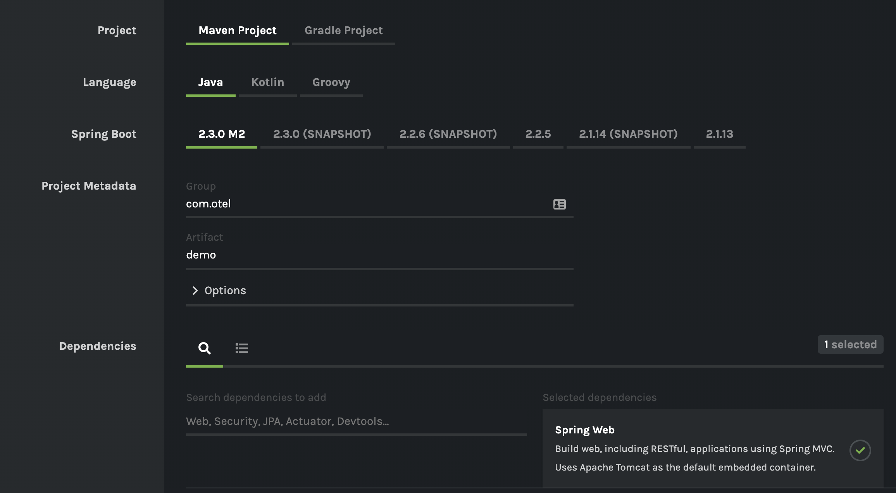

# Setup
1) Use the Spring initalizer to create a Spring Boot Application with Spring Web as a dependency. 


2) Add the Open tracing SDK dependency as well as the jaegar exporter dependencies
``` xml
        <dependency>
      		<groupId>io.opentelemetry</groupId>
     		<artifactId>opentelemetry-api</artifactId>
      		<version>0.2.0</version>
        </dependency>
		<dependency>
      		<groupId>io.opentelemetry</groupId>
     		<artifactId>opentelemetry-sdk</artifactId>
      		<version>0.2.0</version>
        </dependency>
		<dependency>
			<groupId>io.opentelemetry</groupId>
			<artifactId>opentelemetry-exporters-logging</artifactId>
			<version>0.2.0</version>
		</dependency>
		<dependency>
			<groupId>io.opentelemetry</groupId>
			<artifactId>opentelemetry-exporters-jaeger</artifactId>
			<version>0.2.0</version>
		</dependency>

		<dependency>
			<groupId>io.grpc</groupId>
			<artifactId>grpc-protobuf</artifactId>
			<version>1.27.2</version>
		</dependency>
		<dependency>
			<groupId>io.grpc</groupId>
			<artifactId>grpc-netty</artifactId>
			<version>1.27.2</version>
		</dependency>
```

3) Create a model to return from our future controller
``` java
   package com.otel.demo;


public class Greeting {

    private final long id;
    private final String content;

    public Greeting(long id, String content) {
        this.id = id;
        this.content = content;
    }

    public long getId() {
        return id;
    }

    public String getContent() {
        return content;
    }
}
```

4) Create a controller to return our model. 

``` java
package com.otel.demo;

import java.util.concurrent.atomic.AtomicLong;


import org.springframework.web.bind.annotation.RequestMapping;
import org.springframework.web.bind.annotation.RequestParam;
import org.springframework.web.bind.annotation.RestController;


@RestController
public class SomeController {
    private final AtomicLong counter = new AtomicLong();

    
    @RequestMapping("/api/1")
    public Greeting greeting(@RequestParam(value="name", defaultValue="level1Default") String name) {

            return new Greeting(counter.incrementAndGet(), getContent());

    }

    public String getContent(){

        return "Some content";
    }

}
```
5) Do `mvn spring-boot:run` to run the application. Navigate to localhost:8080/api/1 to see your content and make sure you have everything configured correctly.

# Collect Trace Data
You need to configure a TraceProvider to collect tracing information. A tracer is an object that tracks the currently active span and allows you to create (or activate) new spans. As spans are created and completed, the tracer dispatches them to an exporter that can send the spans to a backend system for analysis.

We want a singleton for our application, so we'll create a Bean that returns our tracer instance.

1) Create a class called OtelConfig that looks like this.
``` java
package com.otel.demo;

import org.springframework.boot.autoconfigure.jdbc.DataSourceAutoConfiguration;
import org.springframework.boot.autoconfigure.orm.jpa.HibernateJpaAutoConfiguration;
import org.springframework.context.annotation.Bean;
import org.springframework.context.annotation.Configuration;

import io.grpc.ManagedChannelBuilder;
import io.opentelemetry.OpenTelemetry;
import io.opentelemetry.sdk.OpenTelemetrySdk;
import io.opentelemetry.sdk.trace.SpanProcessor;
import io.opentelemetry.sdk.trace.export.SimpleSpansProcessor;
import io.opentelemetry.trace.Tracer;
import io.opentelemetry.exporters.jaeger.JaegerGrpcSpanExporter;
import io.opentelemetry.exporters.logging.*;

import org.springframework.boot.autoconfigure.EnableAutoConfiguration;


@Configuration
@EnableAutoConfiguration (exclude={DataSourceAutoConfiguration.class, HibernateJpaAutoConfiguration.class})
public class OtelConfig {

    @Bean
    public Tracer otelTracer() throws Exception{
        final Tracer tracer = OpenTelemetry.getTracerFactory().get("com.forrest.levelone");
        SpanProcessor jaegerProcessor =
            SimpleSpansProcessor.newBuilder(JaegerGrpcSpanExporter.newBuilder()
            .setServiceName("otel_spring")
            .setChannel(ManagedChannelBuilder.forAddress(
            "localhost", 14250).usePlaintext().build())
            .build()).build();    

        SpanProcessor logProcessor = SimpleSpansProcessor.newBuilder(new LoggingExporter()).build();

        OpenTelemetrySdk.getTracerFactory().addSpanProcessor(logProcessor);
        OpenTelemetrySdk.getTracerFactory().addSpanProcessor(jaegerProcessor);

        return tracer;
    }
}
```

### What's here?
* First, the `Tracer`. This class is responsible for building spans which make up our future traces.
* `Span Processors` and/or `Exporters` are responsible for doing something with our spans, and multiple can be registered to a single tracer. Here we see that we are using a Logging exporter as well as the `JaegerGrpcSpanExporter`. The former logs spans to the console which is great during dev, and the latter sends spans to Jaeger, which we are going to run shortly.
* Sending spans to Jaeger requires setting up a gRPC `ManagedChannel` which is why we pulled those dependencies in earlier. Here we are sending them to `localhost port` `14250`. Jaeger accepts gRPC spans to this port by default


2) Get an Autowired Tracer instance in our Controller.
``` java
  
    @Autowired
    Tracer tracer;
```
3) and now let's create some spans.
``` java
package com.otel.demo;

import java.util.concurrent.atomic.AtomicLong;

import org.springframework.beans.factory.annotation.Autowired;
import org.springframework.web.bind.annotation.RequestMapping;
import org.springframework.web.bind.annotation.RequestParam;
import org.springframework.web.bind.annotation.RestController;

import io.opentelemetry.context.Scope;
import io.opentelemetry.trace.Span;
import io.opentelemetry.trace.Tracer;


@RestController
public class SomeController {
    private final AtomicLong counter = new AtomicLong();

    @Autowired
    Tracer tracer;
    
    @RequestMapping("/api/1")
    public Greeting greeting(@RequestParam(value="name", defaultValue="level1Default") String name) {
            Span span = tracer.spanBuilder("api/1").startSpan();
            span.addEvent("Controller Entered");
            span.setAttribute("counter.id", counter.get());
            
            try(Scope scope = tracer.withSpan(span)){
                return new Greeting(counter.incrementAndGet(), getContent());
            }
            catch(Exception e){
                span.addEvent("error");
                span.setAttribute("error", true);
                return new Greeting(0l, "critical failure");
            }
            finally{
                span.end();
            }

    }

    public String getContent(){
        Span span = tracer.spanBuilder("getContent").startSpan();
        span.setAttribute("content.type", "text");
        span.end();
        return "Some content";
    }

}
```
# Explore the Data
1) Run your application again with `mvn spring-boot:run`. 
2) Run the Jaeger all in 1 image with
```
docker run -d -p 6831:6831/udp -p 16686:16686 -p 14250:14250
jaegertracing/all-in-one:latest
```
3) Hit `localhost:8080/api/1` a few times and then navigate to `localhost:16686` to view the traces in Jaeger.
3a) Feel free to remove the LogExporter at this point

# Propagate Context - Instrument the interceptor
You've probably noticed that there is quite a bit of tracing code in our controller. Some of it we can abstract away into Spring itself. We can do this by using the concept of an interceptor to trace request in and out of our service. Then, engineers can add more bespoke spans into methods where it suits them.

This approach means that you can create controllers on a whim and ensure they are traced, propagate context correctly, and add more in depth tracing as you like.

1) Create an Interceptor class